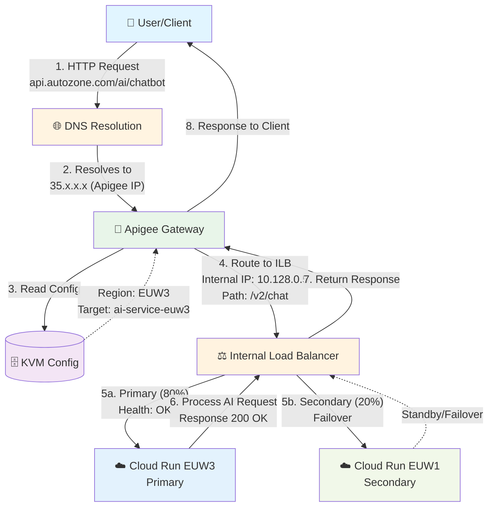
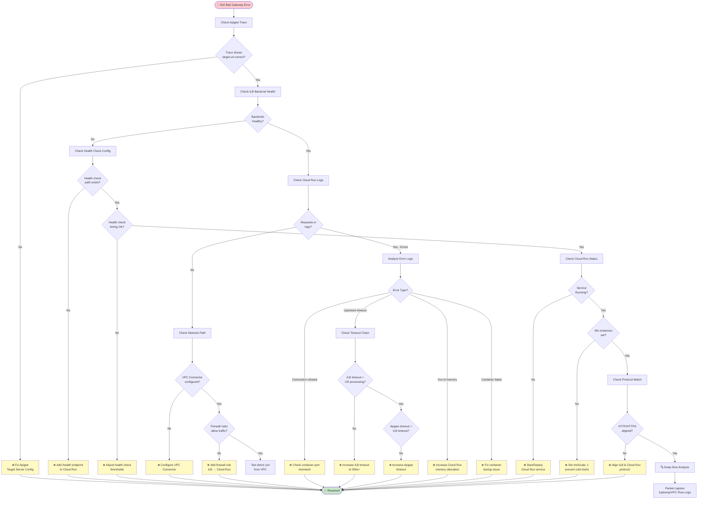
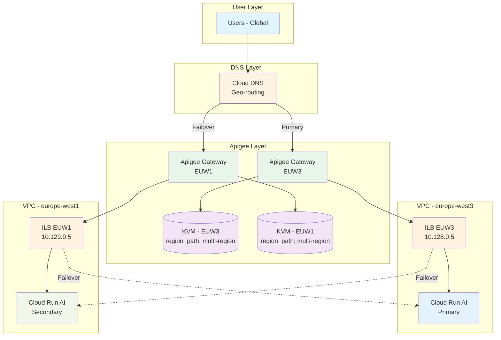

# Apigee Multi-Region Configuration & 502 Debugging Guide

**Date:** 2026-09-02  
**Author:** Technical Program Manager  
**Context:** AI Services in GCP Cloud Run with Apigee (EUW3 Primary, EUW1 Secondary)

---

## Table of Contents
1. [E2E Request Flow Diagram](#e2e-request-flow-diagram)
2. [502 Debugging Decision Tree](#502-debugging-decision-tree)
3. [Component Explanations](#component-explanations)
4. [Debugging Steps](#debugging-steps)
5. [Common Root Causes](#common-root-causes)
6. [Quick Reference Commands](#quick-reference-commands)

---

## E2E Request Flow Diagram



---

## 502 Debugging Decision Tree



---

## Component Explanations

### 🌐 DNS (Domain Name System)
**Role:** The phone book of the internet

- **What it does:** Converts friendly names to IP addresses
- **Example:** 
  - User calls: `api.autozone.com/ai-service`
  - DNS translates to: `35.x.x.x` (Apigee's IP address)
- **Multi-region:** DNS can route traffic based on:
  - Geography (EU users → EUW3)
  - Health checks (if EUW3 down → EUW1)

---

### 📍 Base Path
**"The street address of your API"**

- **What it is:** The URL path users see/call
- **Example:** `/ai/chatbot` or `/v1/recommendation`
- **In Apigee:** Defined in the API Proxy configuration
  ```
  https://api.autozone.com/ai/chatbot
                          ↑
                     Base Path
  ```
- **Purpose:** Clean, consistent URL for consumers regardless of backend changes

---

### 🎯 Target Path
**"The actual door number inside the building"**

- **What it is:** The real path on your backend service
- **Example:** Your Cloud Run service expects `/v2/chat`
- **Apigee rewrites:**
  ```
  User calls:    /ai/chatbot  (Base Path)
  Apigee sends:  /v2/chat     (Target Path)
  ```
- **Current hardcoding issue:** Different target paths in Dev/QA vs Stage/Prod
  ```
  Dev/QA:   /europe-west3/ai-service
  Prod:     /multi-region/ai-service  (hardcoded)
  ```

---

### 🗄️ KVM (Key-Value Maps)
**"A configuration dictionary"**

- **What it is:** Secure storage for environment-specific settings
- **Use cases:**
  ```
  Key                    | Value
  ----------------------|------------------------
  PRIMARY_REGION        | europe-west3
  SECONDARY_REGION      | europe-west1
  AI_SERVICE_URL        | https://ai-svc.run.app
  TIMEOUT_MS            | 30000
  ```
- **Benefits:**
  - No hardcoding in proxy code
  - Change values without redeploying proxy
  - Different values per environment (Dev/QA/Prod)
  
- **Better solution for hardcoding issue:**
  ```javascript
  // Instead of hardcoding paths, use KVM:
  var region = context.getVariable("kvm.PRIMARY_REGION");
  var targetPath = "/services/" + region + "/ai";
  ```

---

### 🖥️ Target Backend Server
**"Where Apigee actually sends the request"**

- **What it is:** The Cloud Run service endpoint
- **Configuration in Apigee:**
  ```
  Target Server Name: ai-service-euw3
  Host: ai-service-abc123.run.app
  Port: 443
  SSL: Enabled
  ```

- **Multi-region setup:**
  ```
  Target Server 1: ai-service-euw3 (Primary)
  Target Server 2: ai-service-euw1 (Secondary)
  ```

- **Apigee decides which to use** based on:
  - Load balancing policy
  - Health checks
  - Failover rules

---

### ⚖️ ILB (Internal Load Balancer)
**"The bouncer at the VPC door"**

- **What it is:** GCP's internal load balancer
- **Role in your setup:**
  ```
  Apigee (in Google-managed VPC)
     ↓
  ILB (your VPC)
     ↓
  Cloud Run AI Services (EUW3 or EUW1)
  ```

- **Why needed:**
  - Cloud Run is serverless - ILB provides stable internal endpoint
  - Distributes traffic across multiple Cloud Run instances
  - Enables private connectivity (not public internet)

- **Configuration:**
  ```
  ILB Frontend: 10.x.x.x (internal IP)
  ILB Backend: 
    - Cloud Run Service 1 (EUW3) - 80% traffic
    - Cloud Run Service 2 (EUW1) - 20% traffic
  ```

---

## Complete Request Flow Example

```
1. User calls: https://api.autozone.com/ai/chatbot

2. DNS resolves: api.autozone.com → 35.x.x.x (Apigee IP)

3. Apigee receives request on Base Path: /ai/chatbot

4. Apigee reads KVM:
   - PRIMARY_REGION = "europe-west3"
   - TARGET_SERVER = "ai-service-euw3"

5. Apigee rewrites path:
   - From: /ai/chatbot
   - To: /v2/chat (Target Path)

6. Apigee calls Target Backend Server via ILB:
   - ILB internal IP: 10.128.0.5
   - Forwards to: Cloud Run in EUW3

7. Cloud Run processes: /v2/chat

8. Response flows back through same path

9. User gets response
```

---

## Debugging Steps

### What Does 502 Mean?

```
✅ Request reached ILB successfully
❌ ILB couldn't get valid response from Cloud Run (Target Backend)
```

**Translation:** The problem is between ILB and Cloud Run, NOT between user and Apigee.

---

### 🔍 Step 1: Check Apigee Trace (Start Here!)

**Why:** Apigee captures the full request/response flow

**How to Access:**
```
Apigee Console → API Proxies → [Your AI Service Proxy] → Trace
```

**Key Variables to Check:**
```
target.url              → What URL did Apigee call?
target.host             → Correct backend server?
target.port             → Usually 443 for Cloud Run
target.error.message    → Actual error from backend
response.status.code    → 502
response.reason.phrase  → "Bad Gateway"
upstream.response.time  → How long before timeout?
```

**PowerShell Command:**
```powershell
# If you have Apigee API access
$apiProxy = "ai-service-proxy"
$org = "autozone"
$env = "prod"

curl -H "Authorization: Bearer $token" `
  "https://apigee.googleapis.com/v1/organizations/$org/environments/$env/apis/$apiProxy/traces"
```

---

### 🔍 Step 2: Check ILB Health Checks

**Why:** ILB marks backends as unhealthy if they fail health checks

**GCP Console Path:**
```
Network Services → Load Balancing → [Your ILB] → Backend Services
```

**PowerShell Command:**
```powershell
# Check ILB backend health
gcloud compute backend-services get-health ai-service-backend-euw3 `
  --region=europe-west3 `
  --project=your-gcp-project

# Output shows:
# healthStatus:
# - healthState: UNHEALTHY
#   instance: cloud-run-service
#   ipAddress: 10.x.x.x
```

**Common Issues:**
- ❌ Health check path wrong: `/health` vs `/healthz`
- ❌ Health check timeout too short
- ❌ Cloud Run not responding to health checks
- ❌ Health check port mismatch (80 vs 443)

---

### 🔍 Step 3: Check Cloud Run Logs

**Why:** See if requests are arriving and what errors Cloud Run is throwing

**GCP Console Path:**
```
Cloud Run → [Your Service] → Logs
```

**PowerShell Command:**
```powershell
# Get Cloud Run logs for last 10 minutes
gcloud logging read "resource.type=cloud_run_revision 
  AND resource.labels.service_name=ai-service
  AND severity>=ERROR
  AND timestamp>=2026-09-02T10:00:00Z" `
  --limit=50 `
  --project=your-gcp-project `
  --format=json

# Filter for 502-related errors
gcloud logging read "resource.type=cloud_run_revision 
  AND resource.labels.service_name=ai-service
  AND (textPayload=~'502' OR textPayload=~'Bad Gateway')" `
  --limit=20
```

**Common Error Patterns:**

| Log Message | Root Cause | Fix |
|-------------|------------|-----|
| "connection refused" | Cloud Run not listening on port | Check container port |
| "upstream timeout" | Request taking too long | Increase timeout or optimize code |
| "out of memory" | Container crashed | Increase memory allocation |
| "container failed to start" | Image/startup issue | Check startup logs |
| No logs at all | Traffic not reaching Cloud Run | Check ILB config/firewall |

---

### 🔍 Step 4: Check Network Connectivity

**4.1 Check VPC Connector (Cloud Run → VPC)**

```powershell
# List VPC connectors
gcloud compute networks vpc-access connectors list `
  --region=europe-west3 `
  --project=your-gcp-project

# Describe specific connector
gcloud compute networks vpc-access connectors describe ai-service-connector `
  --region=europe-west3 `
  --project=your-gcp-project
```

**What to Check:**
- ✅ State: READY
- ✅ Subnet: Matches ILB subnet
- ✅ IP range: Not overlapping with other services

**4.2 Check Firewall Rules**

```powershell
# List firewall rules affecting ILB → Cloud Run
gcloud compute firewall-rules list `
  --filter="targetTags:cloud-run OR targetTags:ilb" `
  --project=your-gcp-project
```

**Required Firewall Rule:**
```yaml
Name: allow-ilb-to-cloudrun
Direction: INGRESS
Source ranges: [10.128.0.0/20]  # ILB subnet
Target tags: cloud-run
Allowed: tcp:8080,tcp:443
```

**4.3 Test Direct Connectivity**

```powershell
# Create a test VM in same VPC
gcloud compute instances create test-vm `
  --zone=europe-west3-a `
  --subnet=ilb-subnet `
  --project=your-gcp-project

# SSH into VM
gcloud compute ssh test-vm --zone=europe-west3-a

# Test connectivity from inside VPC
curl -v https://ai-service-abc123.run.app/health
# or via ILB internal IP
curl -v http://10.128.0.5/health
```

---

### 🔍 Step 5: Check Cloud Run Configuration

**Common Misconfigurations Leading to 502:**

```powershell
# Get Cloud Run service details
gcloud run services describe ai-service `
  --region=europe-west3 `
  --project=your-gcp-project `
  --format=yaml
```

**What to Verify:**

| Setting | Where to Check | Common Issue |
|---------|---------------|--------------|
| **Container Port** | `containerPort: 8080` | Mismatch with ILB (expects 443) |
| **Timeout** | `timeoutSeconds: 300` | Too short for AI processing |
| **Memory** | `memory: 2Gi` | AI model needs more RAM |
| **CPU** | `cpu: 2` | Underpowered for AI workload |
| **Min Instances** | `minScale: 1` | Cold start causing timeouts |
| **Ingress** | `ingress: internal` | Must be `internal` for ILB |
| **VPC Connector** | `vpcAccess: connector` | Missing or wrong connector |

**Example Fix:**
```powershell
# Update Cloud Run timeout
gcloud run services update ai-service `
  --timeout=600 `
  --region=europe-west3 `
  --project=your-gcp-project

# Update memory
gcloud run services update ai-service `
  --memory=4Gi `
  --region=europe-west3
```

---

### 🔍 Step 6: Check ILB Configuration

```powershell
# Get ILB backend service details
gcloud compute backend-services describe ai-service-backend-euw3 `
  --region=europe-west3 `
  --project=your-gcp-project
```

**Critical Settings:**

```yaml
# Backend Service Config
timeoutSec: 30  # ← Should match or exceed Cloud Run timeout!
protocol: HTTPS  # Must match Cloud Run (HTTP vs HTTPS)
port: 443
healthChecks:
  - checkIntervalSec: 10
    timeoutSec: 5
    healthyThreshold: 2
    unhealthyThreshold: 3
    requestPath: /health  # ← Must exist on Cloud Run!
```

**Common 502 Causes:**

| Issue | Symptom | Fix |
|-------|---------|-----|
| ILB timeout < Cloud Run processing time | 502 after 30s | Increase `timeoutSec` to 300+ |
| Wrong protocol (HTTP vs HTTPS) | Immediate 502 | Match Cloud Run listener |
| Health check path doesn't exist | All backends unhealthy | Fix `/health` endpoint |
| Health check too aggressive | Intermittent 502s | Increase thresholds |

**Fix Timeout:**
```powershell
gcloud compute backend-services update ai-service-backend-euw3 `
  --timeout=300 `
  --region=europe-west3 `
  --project=your-gcp-project
```

---

### 🔍 Step 7: Check End-to-End Timeout Chain

**502 often means timeout mismatch!**

```
Component          Timeout Setting       Recommended
─────────────────────────────────────────────────────
User/Browser       120s                  N/A
↓
Apigee Proxy       60s (default)         120s+
↓
ILB Backend        30s (default)         300s+
↓
Cloud Run          300s (default)        300s
↓
AI Model           Actual: 45s           N/A
```

**The Rule:** Each layer timeout must be > next layer's timeout

**Check Apigee Timeout:**
```xml
<!-- In your API Proxy TargetEndpoint -->
<TargetEndpoint name="default">
  <HTTPTargetConnection>
    <Properties>
      <Property name="io.timeout.millis">120000</Property>  <!-- 120s -->
    </Properties>
  </HTTPTargetConnection>
</TargetEndpoint>
```

---

## 🎯 Debugging Checklist (In Order)

```
□ 1. Check Apigee Trace - What URL/error?
□ 2. Check ILB backend health status
□ 3. Check Cloud Run logs - Are requests arriving?
□ 4. Check Cloud Run service status - Is it running?
□ 5. Check timeout chain - ILB > Cloud Run processing time?
□ 6. Check firewall rules - Is traffic allowed?
□ 7. Check VPC connector - Is Cloud Run connected to VPC?
□ 8. Check health check endpoint - Does /health exist?
□ 9. Check protocol match - HTTP vs HTTPS alignment?
□ 10. Test direct curl from VPC - Can you reach Cloud Run?
```

---

## Common Root Causes

### 🚨 By Frequency

#### 1. Timeout Mismatch (60%)
```
ILB timeout (30s) < Cloud Run processing (45s)
→ ILB gives up and returns 502 to Apigee
```
**Fix:** Increase ILB timeout to 300s

#### 2. Unhealthy Backend (20%)
```
Health check fails → ILB marks backend unhealthy → 502
```
**Fix:** Fix health check endpoint or thresholds

#### 3. Cloud Run Cold Start (10%)
```
No min instances → cold start takes 15s → ILB timeout → 502
```
**Fix:** Set `minScale: 1` on Cloud Run

#### 4. Network/Firewall (5%)
```
Firewall blocks ILB → Cloud Run traffic → connection refused → 502
```
**Fix:** Add firewall rule allowing ILB subnet

#### 5. Wrong Target Configuration (5%)
```
Apigee points to old ILB IP → connection refused → 502
```
**Fix:** Update Apigee target server with correct ILB IP

---

## Quick Reference Commands

### One-Page Quick Debug Script

Save as `debug-502.ps1`:

```powershell
# Debug 502 Error - Apigee → ILB → Cloud Run
param(
    [string]$project = "your-gcp-project",
    [string]$service = "ai-service",
    [string]$region = "europe-west3",
    [string]$ilbName = "ai-service-backend-euw3"
)

Write-Host "🔍 Debugging 502 Error for $service" -ForegroundColor Cyan

# 1. Cloud Run Status
Write-Host "`n1️⃣ Cloud Run Service Status:" -ForegroundColor Yellow
gcloud run services describe $service --region=$region --project=$project --format="table(status.conditions.type,status.conditions.status)"

# 2. Cloud Run Recent Errors
Write-Host "`n2️⃣ Cloud Run Recent Errors (last 10 min):" -ForegroundColor Yellow
$timestamp = (Get-Date).AddMinutes(-10).ToString("yyyy-MM-ddTHH:mm:ssZ")
gcloud logging read "resource.type=cloud_run_revision AND resource.labels.service_name=$service AND severity>=ERROR AND timestamp>='$timestamp'" --limit=10 --project=$project

# 3. ILB Backend Health
Write-Host "`n3️⃣ ILB Backend Health:" -ForegroundColor Yellow
gcloud compute backend-services get-health $ilbName --region=$region --project=$project

# 4. ILB Configuration
Write-Host "`n4️⃣ ILB Timeout Configuration:" -ForegroundColor Yellow
gcloud compute backend-services describe $ilbName --region=$region --project=$project --format="value(timeoutSec)"

# 5. VPC Connector Status
Write-Host "`n5️⃣ VPC Connector Status:" -ForegroundColor Yellow
gcloud compute networks vpc-access connectors list --region=$region --project=$project

# 6. Firewall Rules
Write-Host "`n6️⃣ Relevant Firewall Rules:" -ForegroundColor Yellow
gcloud compute firewall-rules list --filter="targetTags:cloud-run OR targetTags:ilb" --project=$project --format="table(name,direction,sourceRanges,allowed)"

Write-Host "`n✅ Debug Complete" -ForegroundColor Green
```

**Run it:**
```powershell
.\debug-502.ps1 -project "autozone-prod" -service "ai-service" -region "europe-west3"
```

---

## Hardcoding Issue - Proposed Solution

### Current Problem
```javascript
// Hardcoded in Apigee proxy
if (environment == "prod") {
  targetPath = "/multi-region/ai-service";  // ❌ Hardcoded
} else {
  targetPath = "/europe-west3/ai-service";  // ❌ Hardcoded
}
```

### Recommended Solution: Use KVM

**Step 1: Create KVM entries per environment**

```
Environment: dev
Key: region_path | Value: europe-west3

Environment: qa
Key: region_path | Value: europe-west3

Environment: stage
Key: region_path | Value: multi-region

Environment: prod
Key: region_path | Value: multi-region
```

**Step 2: Update Apigee proxy code**

```javascript
// Read from KVM - no hardcoding
var region = context.getVariable("kvm.region_path");
var targetPath = "/services/" + region + "/ai";
```

**Benefits:**
- ✅ No code changes between environments
- ✅ Easy to update (just change KVM value)
- ✅ No redeployment needed
- ✅ Consistent structure across all environments

---

## Architecture Diagram - Multi-Region Setup



---

## Next Steps / Recommendations

### Immediate Actions
1. **Replace hardcoded paths with KVM** - Eliminates environment-specific code
2. **Set up monitoring alerts** - ILB backend health failures
3. **Document runbook** - Share with on-call team
4. **Test failover** - EUW3 → EUW1 scenarios

### Long-term Improvements
1. **Automated health monitoring** - Proactive 502 detection
2. **SLO/SLA tracking** - 99.9% availability target
3. **Load testing** - Validate timeout configurations
4. **Disaster recovery plan** - Complete region failover procedure

---

## Contact / Escalation

**For 502 Issues:**
- Check this guide first
- Run debug script: `debug-502.ps1`
- Review Apigee trace + Cloud Run logs
- Escalate to: [Platform Team / SRE]

**For Configuration Changes:**
- KVM updates: [Apigee Admin]
- ILB changes: [Network Team]
- Cloud Run changes: [Cloud Platform Team]

---

**Document Version:** 1.0  
**Last Updated:** 2026-09-02  
**Maintained By:** Technical Program Manager
